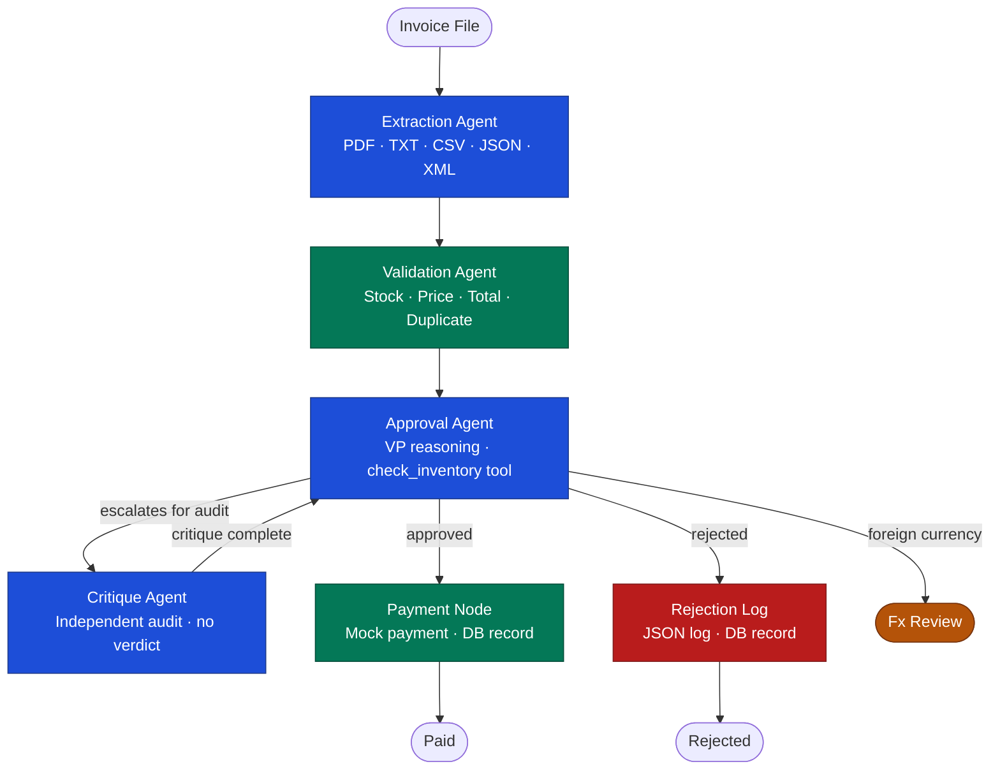
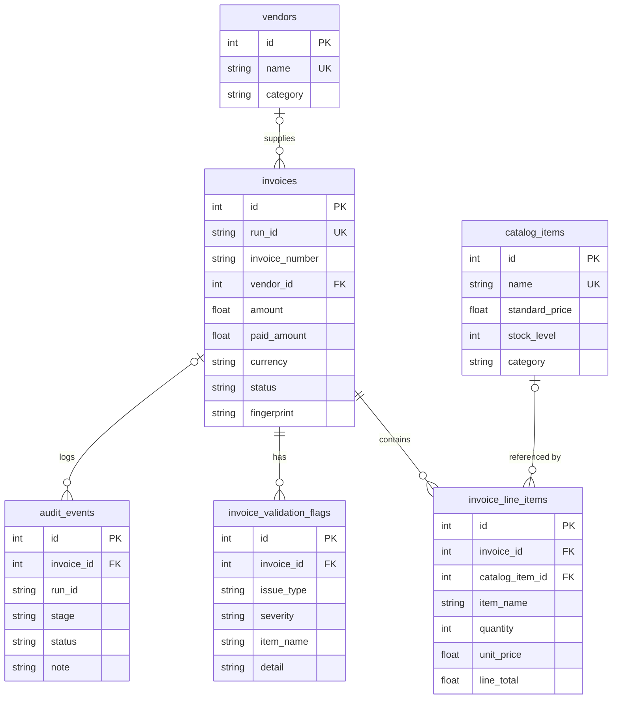
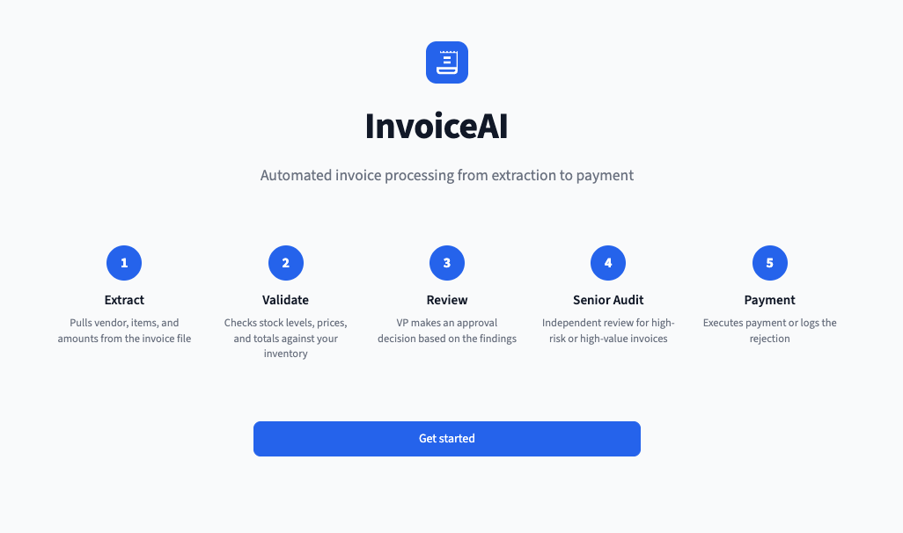
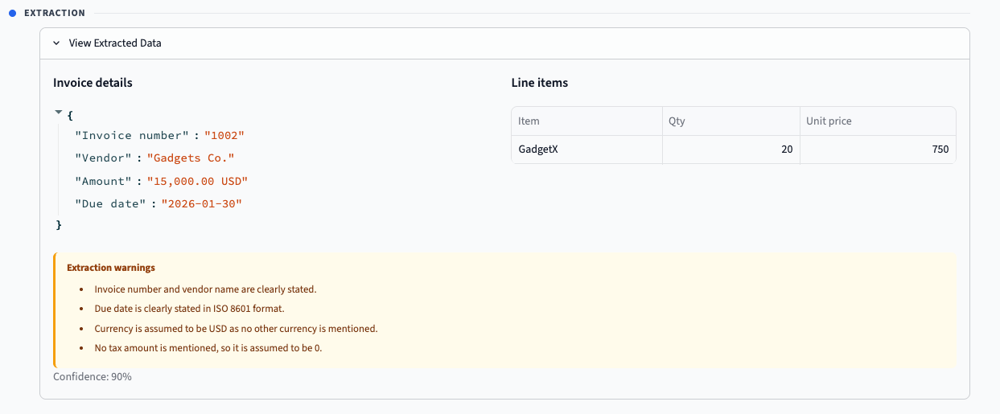
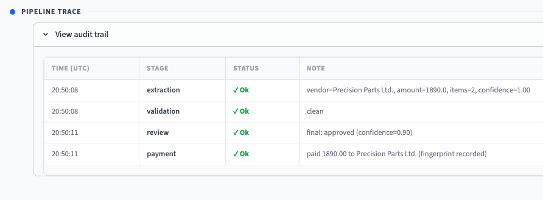
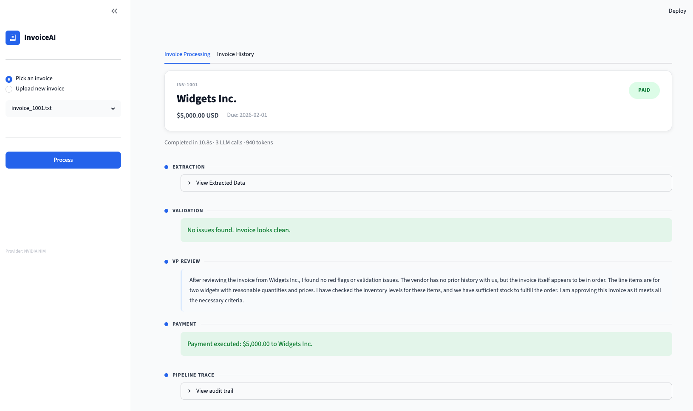
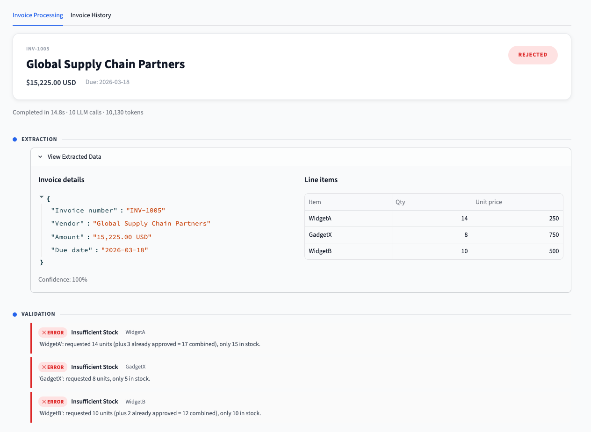
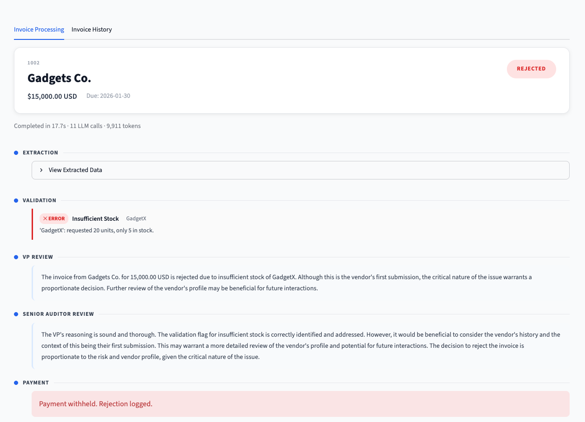
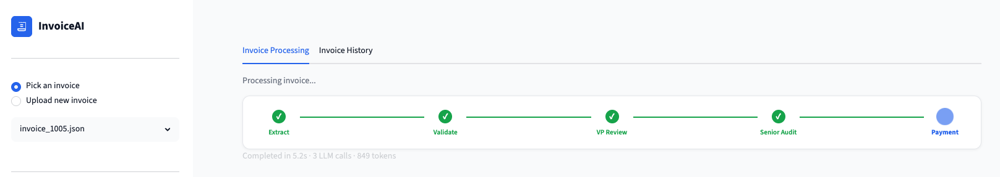
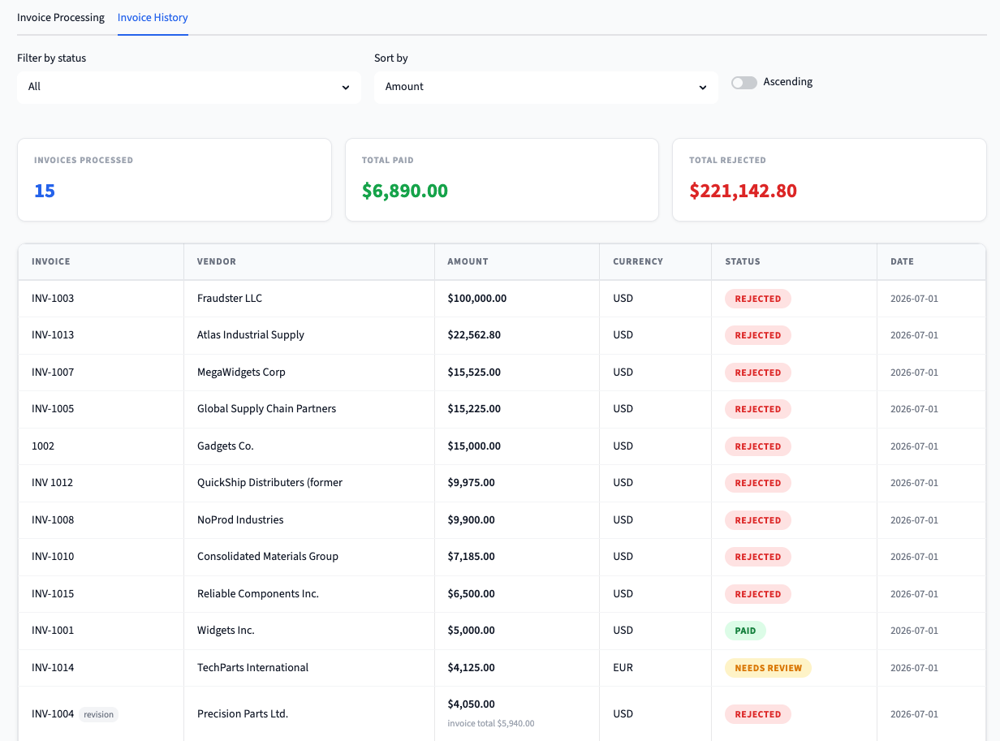

# InvoiceAI

> A multi-agent AI pipeline that automates invoice ingestion, validation, approval, and payment for Acme Corp.
> Built as a technical assessment for the Galatiq.ai FDE role.
> The original assessment brief is in [REQUIREMENTS.md](REQUIREMENTS.md).

---

## The problem

Acme Corp is a PE-backed manufacturing firm losing **$2M/year** on manual invoice processing. Invoices arrive via email as PDFs in messy formats. Staff manually extract data, validate against a legacy inventory database, obtain VP approval via email chains, and process payment via a banking API.

**Current pain points:** 30% error rate · 5-day processing delays · frustrated stakeholders.

---

## What this is

Acme Corp processes invoices manually: extracting data, checking stock, getting VP sign-off, then paying. This prototype replaces that with a four-stage AI agent pipeline backed by a persistent SQLite database and a Streamlit UI.

| Stage | What it does | Who does it |
|---|---|---|
| **Extraction** | Reads PDF/TXT/CSV/JSON/XML; extracts vendor, amount, items, due date | LLM |
| **Validation** | Checks items against inventory DB; flags stock, price, and total issues | Deterministic |
| **Approval** | VP-style reasoning; reflection/critique loop for high-value or risky invoices | LLM |
| **Payment** | Fires mock payment if approved; logs rejection with reasoning | Deterministic |

---

## Architecture



Built on **LangGraph**: each stage is a node in an explicit state graph and shares a single `InvoiceState` object that carries extracted data, validation flags, decisions, and an audit log across the full run. The critique loop is a real cycle in the graph - the Approval node can be re-entered after critique without spawning a new process.

**Pipeline stages:**

| Stage | What happens |
|---|---|
| **Extraction** | LLM reads the raw file (any format) and outputs structured data: vendor, invoice number, line items, due date, total. Runs a self-consistency re-pass if extraction confidence is below 0.8. |
| **Validation** | Deterministic checks: stock levels, price deviation vs catalog, arithmetic total, duplicate detection via invoice number and content fingerprint. Produces typed `ValidationFlag` objects with severity tiers. |
| **Approval** | VP-style LLM reasoning with access to vendor risk profile and a `check_inventory` tool. Outputs a decision and confidence score. Escalates to Critique if the invoice is high-value, high-risk, or confidence is low. |
| **Senior Audit** | Independent LLM audit of the VP's reasoning. Surfaces concerns and portfolio context the VP did not see. Never outputs a verdict, returns a structured review and hands control back to the Approval agent. |
| **Payment / Rejection** | Deterministic outcome node. Fires mock payment and writes to DB if approved; logs rejection with reasoning if rejected. Foreign-currency invoices exit at `needs_review` instead. |

---

## Database schema

Six tables in `acme.db` (3NF, surrogate PKs, `ON DELETE CASCADE` on all invoice child rows; vendor and catalog FKs use `SET NULL` to preserve invoice history if a vendor or catalog item is removed).



`catalog_item_id` on `invoice_line_items` is nullable, items not in the catalog get `NULL` and trigger `unknown_item`. `audit_events.invoice_id` is nullable so parse failures that occur before an invoice row is created can still be recorded by `run_id`.

A separate ops layer (`approved_quantities`, `fingerprints`, `precedents`) lives in the same `acme.db` file under a separate SQLAlchemy session to keep runtime state isolated from analytical data.

---

## Setup

Requires [uv](https://docs.astral.sh/uv/getting-started/installation/).

```bash
# 1. Clone
git clone https://github.com/AlbenZap/galatiq-case-invoices.git
cd galatiq-case-invoices

# 2. Install all dependencies (creates .venv automatically)
uv sync          # or: make install

# 3. Configure API key
cp .env.example .env
# Edit .env and add your NVIDIA_API_KEY (or XAI_API_KEY for Grok)
```

The SQLite database (`acme.db`) is created and seeded automatically on first run.

---

## Usage

### Streamlit UI (recommended)

```bash
make ui
# or: uv run streamlit run app.py
```

Opens at `http://localhost:8501`.

**Upload tab:** select from the built-in invoice library or drag-and-drop your own file. The Process button is disabled while a run is in progress to prevent double-submission.

**Pipeline trail:** each agent step streams in real time with coloured status tags (`ok` / `warning` / `error`). Flags are rendered with human-readable titles and dollar amounts where relevant.

**History tab:** every processed invoice is persisted to the database and shown across sessions. Sort by any column (Invoice, Vendor, Amount, Status, Date) in either direction. Filter by status (All / Paid / Rejected / Needs Review). Three KPI cards above the table update live based on the active filter: total invoices processed, total value paid, total value rejected.

### CLI: single invoice

```bash
make run-example
# or: uv run python main.py --invoice_path=data/invoices/invoice_1001.txt
```

### CLI: batch mode

```bash
make run-batch
# or: uv run python main.py --batch
```

Outputs a summary report: approved count, rejected count, total dollar amounts, flagged invoice IDs, LLM call count, total tokens.

### Tests

```bash
# Unit tests only (fast, no API key needed)
make test

# End-to-end tests (requires API key)
make test-e2e
```

41 unit tests, 32 end-to-end tests (skipped without `INTEGRATION_TESTS=1`).

### Reset / clean

```bash
make clean    # kills Streamlit, wipes acme.db and run logs
make help     # full target list
```

---

## Demo

<video src="docs/videos/demo.mp4" controls width="100%"></video>

<table>
<tr>
<td width="49%"><b>Home</b> - get started page</td>
<td width="49%"><b>Extraction</b> - structured data extracted from raw file</td>
</tr>
<tr>
<td></td>
<td></td>
</tr>
<tr>
<td><b>Pipeline Trail</b> - real-time agent step stream</td>
<td><b>Processing (1)</b> - approved invoice, full pipeline pass</td>
</tr>
<tr>
<td></td>
<td></td>
</tr>
<tr>
<td><b>Processing (2)</b> - rejected invoice, extraction and validation flags</td>
<td><b>Processing (3)</b> - rejected invoice, VP and Senior Auditor reasoning</td>
</tr>
<tr>
<td></td>
<td></td>
</tr>
<tr>
<td><b>Progress</b> - live pipeline progress indicator</td>
<td><b>Invoice History</b> - sortable, filterable history with KPI cards</td>
</tr>
<tr>
<td></td>
<td></td>
</tr>
</table>

---

## Validation flags

The validation agent produces structured `ValidationFlag` objects with a severity tier that drives UI colour and pre-LLM routing weight.

| Flag | Severity | Description |
|---|---|---|
| `out_of_stock` | error | Item exists in catalog but stock is zero |
| `unknown_item` | error | Item not found in inventory at all |
| `duplicate_invoice` | error | Invoice number already approved; short-circuits to rejection |
| `insufficient_stock` | error | Requested quantity exceeds available stock |
| `price_mismatch` | warning | Invoiced unit price deviates more than 20% from catalog price |
| `total_mismatch` | warning | Invoice grand total does not match sum of line items (beyond $0.05 tolerance) |
| `invalid_quantity` | warning | Quantity is zero, negative, or non-integer |
| `revision_of_paid_invoice` | warning | Invoice number was previously paid; delta amount computed for payment |
| `revision_detected` | info | File name or JSON field signals a deliberate revision |
| `foreign_currency` | info | Invoice currency is not USD; routed to `needs_review` |

---

## Critique escalation conditions

The critique loop fires on the first approval pass when any of the following are true:

1. Invoice amount exceeds `HIGH_VALUE_THRESHOLD` ($10,000)
2. Any validation flag has `severity == "error"`
3. VP confidence score falls below `MIN_APPROVAL_CONFIDENCE` (0.65)
4. VP decision is `rejected` (second opinion before finalising)
5. VP decision is `approved` but any validation flags are still present (any severity)

The critique agent outputs a structured review (`critique`, `concerns`) and never outputs a verdict. The VP makes the final call after reading the critique.

---

## Design Decisions

### 1. Validation is deterministic; approval is agentic

"Is there enough stock?" is not a judgment call: it is a database lookup. Deterministic validation catches facts (stock levels, unknown items, arithmetic errors). The LLM is reserved for judgment: *should we approve this invoice given these flags, this vendor, and this amount?* Mixing LLMs into validation would introduce randomness where none is needed, make the validation tests flaky, and obscure accountability.

### 2. The critic never outputs a verdict

The critique pass can only output a critique: never "approved" or "rejected." This eliminates the ambiguity of whether "approved" refers to the invoice or the VP's reasoning. The approval agent (the "VP") is the sole decision-maker, both before and after critique. The critic has access to portfolio-level spend context that the VP did not see on the first pass, making the loop genuinely non-trivial.

### 3. All thresholds are named config constants

`HIGH_VALUE_THRESHOLD`, `TOTAL_MISMATCH_TOLERANCE`, `PRICE_MISMATCH_TOLERANCE`, `MIN_APPROVAL_CONFIDENCE`, `EXTRACTION_CONFIDENCE_THRESHOLD` and others live in `config.py`. Every agent that needs a value reads the constant. Changing any policy is a one-line edit, and the VP prompt is injected with the live value at runtime so the LLM reasoning always reflects the actual threshold.

### 4. Foreign currency invoices route to `needs_review`

INV-1014 is in EUR. The spec says "assume no internet for external APIs" so there is no FX rate source available. Rather than silently guessing a conversion or treating EUR as USD, the pipeline flags `foreign_currency`, still runs stock checks (those do not depend on currency), skips price and budget checks, and routes to a third terminal state `needs_review` rather than forcing approve/reject.

### 5. Revision handling: not a duplicate

`invoice_1004_revised.json` has the same invoice number as `invoice_1004.json` but different content (an additional GadgetX line per a PO amendment). Duplicate detection looks at whether the invoice number was already approved *and* the file has no revision marker. A file named `*_revised*` or a JSON with a `"revision"` field is treated as a deliberate update, flagged as `revision_detected`, and processed as authoritative. If the original was already paid, the pipeline computes the delta amount (`revised_total - original_paid`) and pays only the difference.

### 6. LLM provider choice

Default provider: NVIDIA NIM (`meta/llama-3.1-8b-instruct`). Also supports xAI Grok (set `LLM_PROVIDER=grok`). Both expose an OpenAI-compatible API, so a single `ChatOpenAI` instance handles both via a different `base_url`. NIM is the default.

### 7. Cumulative stock tracking

GadgetX has 5 units in stock. Invoice A requests 3 and is approved. Invoice B also requests 3: checked in isolation it would pass, but only 2 units remain. The validation agent tracks a running total of all previously approved quantities and deducts them before checking any new invoice. This matters in batch mode and in real usage where multiple invoices arrive close together.

### 8. Precedent learning

A `precedent_db` table tracks which flag patterns have consistently led to the same decision across at least `PRECEDENT_CONFIDENCE_THRESHOLD` (10) runs. Invoices below `PRECEDENT_MAX_AMOUNT` ($5,000) whose flag pattern matches a high-confidence precedent can be auto-decided without an LLM call. Invoices above that amount always go through the full LLM path regardless of precedent.

### 9. Vendor risk profiling

The approval agent queries a vendor risk profile before reasoning: known vs. unknown vendor, total submissions, approval/rejection rate, last decision, and the most frequent flag types raised against that vendor. This gives the VP-style prompt contextual grounding that a stateless LLM call cannot provide.

### 10. Normalized database schema

Six tables in 3NF with surrogate PKs, `UNIQUE` constraints on natural keys, `ON DELETE CASCADE` on all child tables, and indexes on every FK and commonly filtered column. `line_total` is stored as `qty × price` at write time rather than derived at query time, which is a deliberate denormalization for read performance.

---

## Expanded assumptions

- **Unit prices and category added to inventory:** the spec seed data only has item name and stock. Added `unit_price`, which enables `price_mismatch` flags when an invoiced unit price deviates more than 20% from the catalog price. Added `category` as contextual metadata returned by the `check_inventory` tool to enrich the VP's reasoning (e.g. "Widget" vs "Gadget") without driving any hard rule.

- **Extraction self-consistency check:** for documents with extraction confidence below 0.8 or any extraction warning, the extraction agent runs a second LLM pass and compares vendor and amount. If they disagree, a warning is added and confidence is capped at 0.5. This catches perception errors that the approval-stage critique loop cannot, because the critique only sees already-extracted data, not the raw invoice.

- **Revision delta payment:** the spec does not say how much to pay when a revision of an already-paid invoice is approved. Paying the full revised total would double-pay the original portion. The pipeline computes `revised_total - original_paid_amount` and pays only the delta, recording it separately in the DB so the history shows both the original payment and the incremental top-up.

- **Content fingerprint for semantic duplicate detection:** duplicate detection cannot rely on invoice number alone. The same underlying transaction can be resubmitted under a different number, which is a common fraud vector. A content fingerprint (hash of vendor + amount + due date) is recorded on every approved invoice and checked at validation time. A matching fingerprint triggers `duplicate_invoice` regardless of whether the invoice number matches.

- **Per-invoice LLM cost receipt:** both the CLI and Streamlit UI surface the number of LLM calls and total tokens consumed per invoice. This makes the operational cost of the agentic system visible, which matters when evaluating whether the pipeline is economically viable at the scale of Acme Corp's invoice volume.

---

## File structure

```
galatiq-case-invoices/
├── data/invoices/           # all invoice files (provided + 1017-1019)
├── docs/                    # screenshots and demo video for README
├── src/
│   ├── agents/              # ingestion, validation, approval, payment
│   ├── db/                  # normalized schema: models, queries, seed, session
│   ├── graph/               # LangGraph state + wiring (state.py, graph.py)
│   ├── parsers/             # one parser per format: txt, csv, json, pdf, xml
│   ├── llm_client.py        # NIM / Grok provider swap via LLM_PROVIDER env var
│   ├── ops_db.py            # inventory, fingerprints, approved quantities
│   └── precedent_db.py      # precedent cache for auto-decisions
├── ui/                      # Streamlit components: views, cards, labels
├── tests/
│   ├── fixtures/            # synthetic edge-case invoices
│   └── test_*.py            # unit tests per agent + end-to-end suite
├── app.py                   # Streamlit entry point
├── config.py                # all policy constants (thresholds, paths, model names)
├── main.py                  # CLI: single invoice and batch mode
└── Makefile                 # ui, test, clean, run-example, run-batch
```
