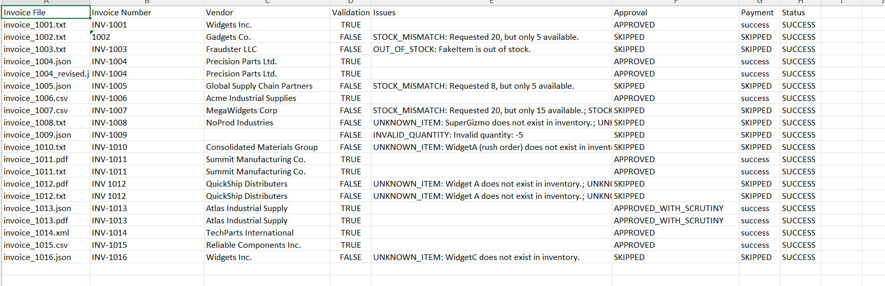

# Multi-Agent Invoice Processing Automation Solution

## Table of Contents

1. Overview
2. System Architecture
3. Design Decisions
4. Project Structure
5. Workflow Execution
6. Testing and Validation
7. Assumptions and Limitations
8. Future Enhancements
9. Conclusion

## Overview

This project implements a multi-agent invoice processing system that automates the complete invoice lifecycle, from document ingestion to payment processing.

The solution combines deterministic business logic with Large Language Models (LLMs) to perform tasks that benefit from AI reasoning while keeping critical business validations deterministic and reliable.

The workflow is orchestrated using LangGraph, where each agent has a clearly defined responsibility and communicates through a shared workflow state. This design promotes modularity, maintainability, and extensibility while keeping the overall workflow easy to understand.

The system supports multiple invoice formats, validates invoice items against an inventory database, performs AI-assisted approval with a reflection step, and processes payments through a mock payment service.

## Technology Stack

| Category                           | Technology                                  |
| ---------------------------------- | ------------------------------------------- |
| Programming Language               | Python 3.11                                 |
| LLM Provider                       | Groq                                        |
| LLM Model                          | Llama 3.x                                   |
| AI Framework                       | LangGraph                                   |
| Data Validation                    | Pydantic                                    |
| Database                           | SQLite                                      |
| Configuration Management           | python-dotenv                               |
| Excel Report Generation (Optional) | openpyxl                                    |
| Testing                            | Python Test Scripts + Batch Test Automation |
| Version Control                    | Git & GitHub                                |

## System Architecture

The application follows a modular multi-agent architecture where each agent is responsible for a single business function. The agents communicate through a shared workflow state managed by LangGraph.

### High-Level Workflow

```text
                Invoice File
                     │
                     ▼
            Ingestion Agent
                     │
                     ▼
          Structured Invoice Model
                     │
                     ▼
           Validation Agent
                     │
        ┌────────────┴────────────┐
        │                         │
 Validation Failed          Validation Passed
        │                         │
        ▼                         ▼
   Workflow Ends          Approval Agent
                                   │
                                   ▼
                             Payment Agent
                                   │
                                   ▼
                          Mock Payment Service
```

### LangGraph Orchestration

The workflow is implemented using LangGraph to coordinate the execution of individual agents.

Each agent performs one specific task and updates a shared workflow state. Instead of each agent directly calling the next one, LangGraph controls the execution flow, making the workflow easier to extend and maintain.

The workflow includes conditional routing:

- If validation fails, the workflow terminates immediately.
- If validation succeeds, the invoice proceeds to the approval and payment stages.

This approach avoids unnecessary LLM calls and ensures invalid invoices are rejected as early as possible.

## Design Decisions

A key objective of this solution was to use AI only where it provides meaningful value while keeping deterministic business operations independent of the LLM.

### Ingestion Agent

The Ingestion Agent is responsible for reading invoice files from multiple formats (TXT, PDF, CSV, JSON, and XML) and extracting structured invoice information.

This task is well suited for an LLM because invoice layouts can vary significantly between vendors. Instead of writing format-specific parsers for every invoice template, the LLM extracts a consistent structured representation containing:

- Vendor information
- Invoice number
- Invoice and due dates
- Invoice items
- Item quantities
- Unit prices
- Total amount

The extracted data is converted into strongly typed Pydantic models before entering the workflow.

---

### Validation Agent

Validation intentionally does not use AI because deterministic business rules should produce consistent and repeatable results. Using an LLM for inventory verification would introduce unnecessary variability into a rule-based process.

Inventory verification is a deterministic business rule and should always produce the same result for the same input.

The Validation Agent queries the SQLite inventory database through the Inventory Tool and validates each invoice item individually.

Validation checks include:

- Unknown inventory items
- Invalid quantities
- Out-of-stock items
- Requested quantity exceeding available inventory

If any validation fails, the workflow terminates immediately, preventing unnecessary AI calls and payment processing.

---

### Approval Agent

The Approval Agent uses an LLM to simulate a VP-level business review.

Unlike inventory validation, approval decisions often require business reasoning rather than deterministic comparisons.

The Approval Agent evaluates:

- Invoice validity
- Total invoice amount
- Business approval rules

After producing an initial decision, the agent performs a second LLM reflection step to verify that the decision follows the defined business rules before returning the final approval result.

---

### Payment Agent

Payment processing is deterministic and therefore does not require AI.

Once an invoice has been approved, the Payment Agent invokes the mock payment service to simulate payment execution.

Separating payment execution from AI reasoning ensures that financial operations remain predictable and auditable.

## Project Organization

The project is organized using a modular architecture that separates business logic, reusable tools, workflow orchestration, data models, testing utilities, and documentation.

```text
galatiq-case-invoices/
│
├── agents/
│   ├── ingestion_agent.py
│   ├── validation_agent.py
│   ├── approval_agent.py
│   └── payment_agent.py
│
├── orchestration/
│   └── invoice_workflow.py
│
├── models/
│   └── invoice_models.py
│
├── tools/
│   ├── llm_tool.py
│   ├── inventory_tool.py
│   └── payment_tool.py
│
├── tests/
│   ├── test_ingestion.py
│   ├── test_validation.py
│   ├── test_approval.py
│   ├── test_payment.py
│   └── test_all_invoices.py
│
├── docs/
│   └── all_invoice_test_results.png
│
├── data/
│   ├── invoices/
│   └── inventory.db
│
├── config.py
├── setup_db.py
├── main.py
├── requirements.txt
├── README.md
└── SOLUTION.md
```

### Folder Responsibilities

**agents/**

Contains the business logic for each stage of the invoice processing workflow. Each agent follows the single-responsibility principle and is responsible for one business function.

**orchestration/**

Contains the LangGraph workflow that orchestrates agent execution, manages workflow state, and performs conditional routing between processing stages.

**models/**

Defines all strongly typed Pydantic models used throughout the application to ensure consistent validation and communication between agents.

**tools/**

Contains reusable helper components shared across multiple agents, including LLM communication, inventory database access, and payment processing.

**tests/**

Contains unit-style test scripts for individual agents and a batch testing utility that validates the complete workflow against all provided invoice samples.

**docs/**

Contains documentation assets referenced by `SOLUTION.md`, including the automated workflow test report.

**data/**

Stores the sample invoice files provided with the assignment along with the SQLite inventory database used during validation.

## Workflow Execution

The application is executed from the command line using:

```bash
python main.py --invoice_path=<path_to_invoice>
```

Throughout the workflow, **LangGraph maintains a shared workflow state** containing the invoice, validation result, approval decision, and payment result. Each agent updates only the portion of the state for which it is responsible, allowing agents to remain loosely coupled while enabling the workflow to coordinate execution.

The execution flow is as follows:

### Step 1 – Invoice Ingestion

The Ingestion Agent reads the invoice file. Depending on the file type (TXT, PDF, CSV, JSON, or XML), the appropriate reader extracts the invoice contents.

The extracted text is sent to the LLM, which converts the unstructured invoice into a structured `Invoice` model.

---

### Step 2 – Inventory Validation

The Validation Agent processes each invoice item individually.

For every item:

1. Retrieve the item from the inventory database.
2. Verify that the item exists.
3. Validate the requested quantity.
4. Compare the requested quantity with available inventory.

If validation fails, the workflow stops immediately and returns the validation issues.

---

### Step 3 – Approval Decision

If validation succeeds, the Approval Agent performs an AI-assisted approval review.

The agent evaluates:

- Validation outcome
- Invoice information
- Total invoice amount
- Business approval rules

After generating an approval decision, the agent performs a reflection step to verify that the decision is consistent with the defined business rules before producing the final approval result.

---

### Step 4 – Payment Processing

Only approved invoices proceed to payment.

The Payment Agent invokes the mock payment service, which simulates payment execution and returns a structured payment result.

Rejected invoices never reach this stage.

---

### Workflow Orchestration

LangGraph coordinates the execution of all agents.

The workflow follows this sequence:

```text
Invoice
   │
   ▼
Ingestion
   │
   ▼
Validation
   │
   ├── Validation Failed ─────► End Workflow
   │
   ▼
Approval
   │
   ▼
Payment
   │
   ▼
End Workflow
```

Using conditional routing allows the workflow to terminate early for invalid invoices, reducing unnecessary computation and avoiding avoidable LLM invocations.

## Testing and Validation

To verify the correctness of the implementation, the workflow was executed against all sample invoices provided with the assignment.

A batch testing script (`tests/test_all_invoices.py`) processes every invoice through the complete LangGraph workflow and generates an automated Excel report summarizing the results.

The testing covers multiple scenarios, including:

- Successful invoice processing
- Stock mismatch detection
- Unknown inventory items
- Invalid quantities
- Out-of-stock items
- High-value invoices requiring additional scrutiny
- Multiple invoice formats (TXT, PDF, CSV, JSON, and XML)

The generated report demonstrates that the workflow correctly routes valid invoices through approval and payment while terminating invalid invoices immediately after validation.

### Automated Test Execution Report

The following report summarizes the execution results for all invoice samples provided with the assignment. The report demonstrates that the workflow correctly handles both successful and failure scenarios across multiple invoice formats, including TXT, PDF, CSV, JSON, and XML.


The automated report demonstrates that the workflow correctly handles both successful and failure scenarios across all invoice formats supplied with the assignment.

> **Note**
>
> The batch testing script (`tests/test_all_invoices.py`) generates the Excel report using the `openpyxl` library.
>
> To run this optional testing utility, install the dependency separately:
>
> ```bash
> pip install openpyxl
> ```
>
> The `openpyxl` package is intentionally not included in `requirements.txt` because it is only used to generate the optional test report and is not required for the core invoice processing application.

## Assumptions and Limitations

The current implementation was designed to satisfy the requirements of the assignment while following software engineering best practices.

### Assumptions

- Invoice files are text-based or contain extractable text.
- The inventory database is maintained separately and contains accurate stock information.
- The payment service is represented by a mock implementation.
- The approval threshold is configurable through the application configuration.
- The LLM returns valid JSON responses following the provided prompt instructions.

### Current Limitations

- Scanned PDF invoices requiring OCR are not currently supported.
- The inventory database uses SQLite, which is appropriate for development but not intended for high-concurrency production workloads.
- Payment processing is simulated through a mock service rather than an external payment provider.
- User authentication and authorization are outside the scope of this assignment.
- Audit logging and persistent workflow history are not implemented.

## Future Enhancements

The current implementation provides a modular foundation that can be extended with additional enterprise capabilities while preserving the existing architecture.

Potential future enhancements include:

- Integrating OCR capabilities to support scanned invoices and image-based documents.
- Replacing SQLite with PostgreSQL or another production-grade relational database for improved scalability and concurrent access.
- Integrating a real payment gateway instead of the current mock payment service.
- Adding audit logging and workflow history to improve traceability and compliance.
- Supporting human approval workflows for high-value invoices or exception handling.
- Adding email, Slack, or Microsoft Teams notifications for invoice approval, rejection, and payment status updates.
- Implementing role-based access control (RBAC) for different user roles such as Finance, Manager, and Administrator.
- Expanding validation rules with vendor-specific business policies and configurable approval thresholds.
- Adding comprehensive unit, integration, and end-to-end tests using Pytest and CI/CD pipelines.
- Containerizing the application using Docker and deploying it to cloud platforms such as Azure, AWS, or Google Cloud.

### Enterprise Integrations with Model Context Protocol (MCP)

As AI agent ecosystems continue to evolve, the system can be extended to leverage the Model Context Protocol (MCP) for standardized communication with external enterprise services.

Potential MCP integrations include:

- Enterprise Resource Planning (ERP) systems such as SAP or Oracle for invoice and vendor management.
- Inventory management systems for real-time stock verification.
- Payment providers and banking APIs for secure payment execution.
- Document management systems for invoice storage and retrieval.
- Communication platforms for automated notifications and approval workflows.

Using MCP would enable agents to interact with external systems through a standardized interface, improving interoperability, simplifying future integrations, and reducing the need for custom connectors while allowing new enterprise integrations to be added with minimal changes to the core agent architecture.

## Engineering Trade-offs

Several design decisions were made while implementing this solution.

- AI was intentionally limited to invoice extraction and approval reasoning, while deterministic business rules such as inventory validation and payment processing remain rule-based for consistency and reliability.

- LangGraph was selected to orchestrate agent execution because it separates workflow coordination from business logic and allows conditional routing without tightly coupling individual agents.

- Shared tools were introduced to isolate infrastructure concerns such as inventory access, payment execution, and LLM communication from the agents themselves, improving maintainability and extensibility.

- SQLite was selected as a lightweight embedded database appropriate for the assignment, while the architecture allows replacement with production databases such as PostgreSQL with minimal changes.

## Conclusion

This solution demonstrates a modular multi-agent architecture that combines deterministic business logic with AI-assisted reasoning to automate the complete invoice processing lifecycle. By clearly separating responsibilities across agents, shared tools, strongly typed data models, and LangGraph orchestration, the system remains maintainable, extensible, and aligned with real-world software engineering practices.

The design intentionally applies AI only where it provides meaningful value while preserving deterministic validation for critical business operations. The resulting architecture is production-oriented, scalable, and provides a practical foundation for building enterprise AI applications that can be further extended with advanced workflow orchestration, external integrations, and Model Context Protocol (MCP)-based services.
